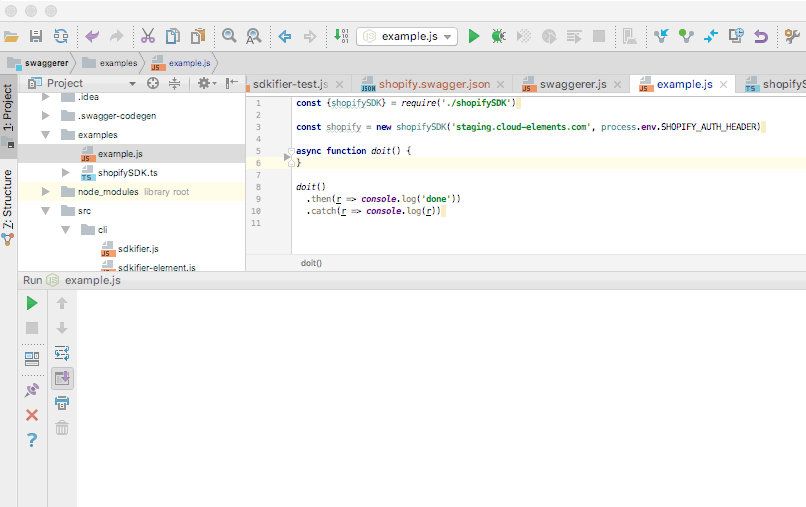

# Cloud Elements SDKifier

[]()
[]()

  A command-line tool for [Cloud Elements](https://cloud-elements.com) to generate SDKs 
  for our Platform and Element APIs.  In the case of Elements, you can choose to generate
  the SDK based on a hub, an element, or an instance.
  
  One major goal for this tool is to generate information for Javascript IDEs to allow them
  to provide autocompletion of allowable methods, parameters, and results.  This tool also provides a 
  platform for future features
  that may be impractical to implement in a server based API, such as automated paging,
  multi-level hydration, etc.
  
  


## Installation

You must have [Node.js](https://nodejs.org) installed in order to use this tool.  Once you do, you can use [npm](https://www.npmjs.com/) to install the SDKifier itself.

    npm install -g ce-sdkifier

You may also install the tool directly from the [github repository](https://github.com/cloud-elements/ce-sdkifier).
```
git clone https://github.com/cloud-elements/ce-sdkifier.git
cd ce-sdkifier
npm install
npm link
```

## Generating an SDK

Run `sdkifier` at the command line to generate the SDK library you'll be calling from your code.
```
  Usage: sdkifier [options] [command]

  Options:

    -V, --version  output the version number
    -h, --help     output usage information

  Commands:

    platform       creates a platform sdk
    hub            creates an sdk for a given hub
    element        creates an sdk for a given element
    instance       creates an sdk for a given instance
    help [cmd]     display help for [cmd]
```

This will generate both [Typescript](https://www.typescriptlang.org/) and Javascript files for you using the naming convention
of `<name>SDK`.  Even if you don't intend to use Typescript, some IDEs use it when available
to provide better autocompletion behavior.

## Use

The code is generated as a [CommonJS module](https://nodejs.org/docs/latest/api/modules.html).
You can `require` and it will produce a class constructor with same name.
The constructor requires the base URL (i.e., `https://api.cloud-elements.com`), and an authorization header.

All methods follow a standard pattern.  The name of the method uses the `operationId` from our
[OpenAPI 2.0](https://github.com/OAI/OpenAPI-Specification/blob/master/versions/2.0.md) 
documentation (AKA Swagger).  This is typically `get`, `create`, `update`, `replace`, or `delete` followed
by the name of the resource.  The parameters to this call will be all of the required parameters for the operation.  The methods use chaining for specifying any optional parameters, followed by a call to `run()`
(see below for an example).  Each method will return a [Promise](https://developer.mozilla.org/en-US/docs/Web/JavaScript/Guide/Using_promises) containing either the body of the
response when successful or the response itself when it fails.


You can also get low level access to the API via the `get`, `post`, `put`, `patch`, and `delete`
methods.

> Note: You must add `"superagent": "^3.8.2"` to the dependencies in your `package.json` file.

## Example

```js
const {shopifySDK} = require('./shopifySDK')

const shopify = new shopifySDK('https://staging.cloud-elements.com', process.env.SHOPIFY_AUTH_HEADER)

async function doit() {
  const products = await
    shopify
      .getProducts()
      .where(`created_at_max='2015-01-01T00:00:00-06:00'`)
      .pageSize(3)
      .run()
  for (let product of products) {
    console.log({
      name: product.handle,
      title: product.title,
      created: product.created_at
    })
  }
}

doit()
  .then(r => console.log('done'))
  .catch(r => console.log(r))
```